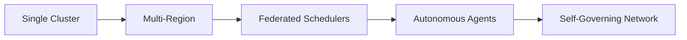

# Future Extensions

## Scalability Enhancements


## Advanced Capabilities
1. **Predictive Scheduling**
   - Machine learning models for resource demand forecasting
   - Automated pre-allocation of VMs based on predictions

2. **Cross-Cloud Federation**
   - Unified API for hybrid environments
   - Automated cost optimization
   - Burst capacity to public clouds

3. **AI-Assisted Troubleshooting**
   - Anomaly detection in agent behavior
   - Automated root cause analysis
   - Self-healing recommendations

## Development Timeline
1. **Phase 1 (Q3 2025)**: Basic TON storage integration
2. **Phase 2 (Q4 2025)**: Toncoin payment processing
3. **Phase 3 (Q1 2026)**: Decentralized task marketplace
4. **Phase 4 (Q2 2026)**: DAO governance implementation
5. **Phase 5 (Q4 2026)**: Cross-chain interoperability

## Research Directions
1. **Quantum-Resistant Cryptography**
   - Lattice-based encryption
   - Hash-based signatures
   - Code-based cryptography

2. **Neuromorphic Computing**
   - Analog computing for ML workloads
   - Energy-efficient inference
   - Adaptive neural architectures

3. **Self-Modifying Agents**
   - Genetic algorithm optimization
   - Runtime behavior adaptation
   - Collective intelligence

## Ecosystem Growth
```mermaid
pie
    title Adoption Strategy
    "Open Source Core" : 40
    "Enterprise Edition" : 30
    "Cloud Marketplace" : 20
    "Hardware Appliances" : 10
