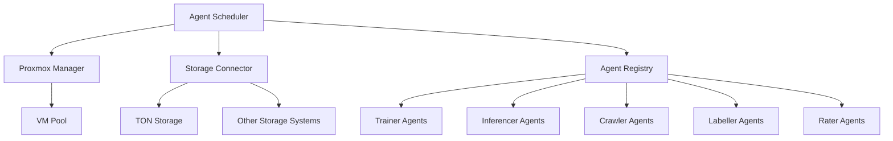

# Core Architecture

## System Components


## Key Design Decisions
1. **Modular Plugins**  
   - Proxmox integration as initial hypervisor plugin
   - Storage connectors designed as interchangeable modules
   - Agent registry supports dynamic addition of new agent types

2. **Stateless Control Plane**  
   - Scheduler maintains only metadata about tasks and agents
   - VM state stored exclusively in distributed storage
   - Enables horizontal scaling and fault tolerance

3. **FlatBuffers Communication**  
   ```python
   # Example communication schema
   table TaskRequest {
     task_id: string;
     agent_type: AgentType;
     resources: ResourceSpec;
     storage_backend: StorageType;
   }
   ```

4. **Incremental State Management**  
   - Only application-specific data persisted (e.g., ML model weights)
   - VM states reconstructed from storage snapshots
   - Reduces storage requirements by 70-90% compared to full VM images
