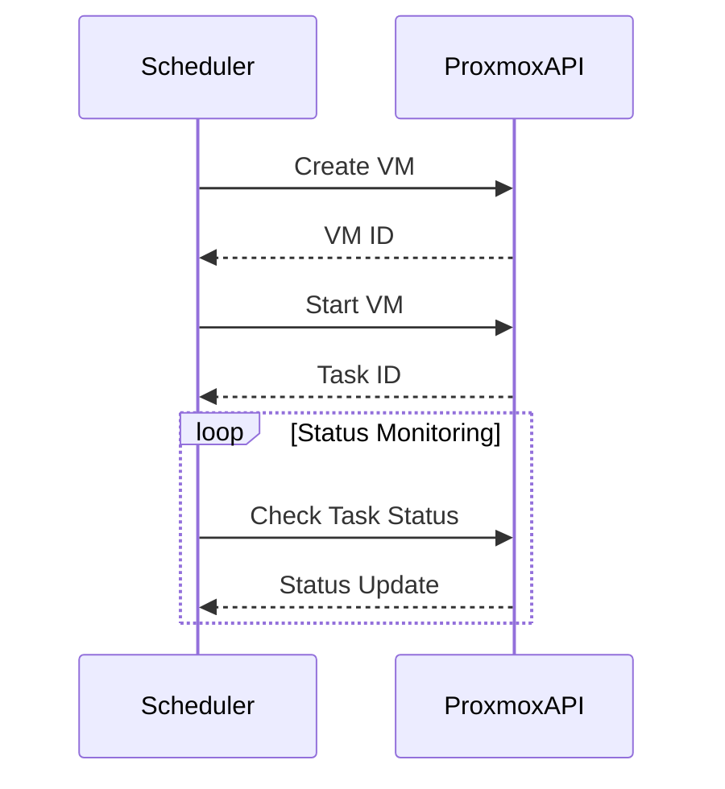

# Proxmox Integration

## Authentication & Security
- **API Token Authentication**: Use tokens with minimal required privileges
- **Secret Management**: Store credentials in environment variables or secret managers
- **Token Rotation**: Implement 90-day token rotation policy
- **Access Control**: Restrict API access to scheduler IP addresses

## Core VM Operations
### Workflow

### API Operations
| Operation | API Path | Parameters |
|----------|----------|------------|
| **Create VM** | `POST /nodes/{node}/qemu` | `vmid`, `name`, `cores`, `memory`, `storage` |
| **Start VM** | `POST /nodes/{node}/qemu/{vmid}/status/start` | - |
| **Stop VM** | `POST /nodes/{node}/qemu/{vmid}/status/stop` | - |
| **Delete VM** | `DELETE /nodes/{node}/qemu/{vmid}` | - |
| **Get Status** | `GET /nodes/{node}/qemu/{vmid}/status/current` | - |

## Error Handling Strategies
1. **Authentication Failures**: Log and alert on invalid credentials
2. **VM Not Found**: Validate VM existence before operations
3. **Configuration Issues**: Monitor Proxmox server health
4. **Parameter Errors**: Implement strict input validation

## Performance Optimization
1. **Connection Pooling**: Reuse API connections
2. **Asynchronous Operations**: Use task IDs for long-running operations
3. **Caching**: Cache node/VM lists to reduce API calls
4. **Rate Limiting**: Implement 100ms delay between operations
