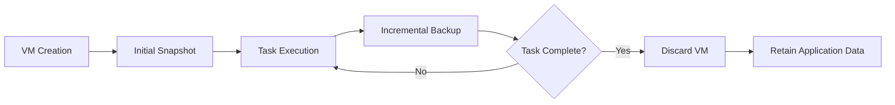

# State Management

## Core Principles
1. **Stateless VMs**: VM images are ephemeral and reconstructed from storage
2. **Incremental Backups**: Only changed blocks persisted after initial snapshot
3. **Application-First**: Prioritize application data over system state
4. **Distributed Integrity**: Hash verification across storage nodes

## State Lifecycle


## Storage Optimization
| Technique | Reduction | Use Case |
|-----------|-----------|----------|
| **Deduplication** | 60-80% | Identical VM templates |
| **Compression** | 30-50% | Text-based application data |
| **Delta Encoding** | 70-90% | VM disk changes |
| **Selective Persistence** | 95%+ | ML weights only |

## API Design
```python
class StateManager:
    def create_snapshot(self, vm_id: str) -> str:
        """Create initial VM snapshot, returns snapshot ID"""
    
    def incremental_backup(self, vm_id: str, snapshot_id: str) -> str:
        """Capture changed blocks, returns backup ID"""
    
    def restore_vm(self, snapshot_id: str, backup_id: str) -> str:
        """Reconstruct VM from snapshot + increments"""
    
    def persist_application_data(self, task_id: str, data: bytes) -> str:
        """Store application-specific data, returns storage ID"""
    
    def retrieve_application_data(self, storage_id: str) -> bytes:
        """Fetch application-specific data"""
```

## Security Measures
1. **Encryption**: AES-256 for data at rest
2. **Access Control**: RBAC for state operations
3. **Audit Logging**: Immutable operation records
4. **Data Sharding**: Fragmentation across storage nodes

## Failure Strategy
- Prefer failing fast during MVP to quickly identify critical issues
- Only implement targeted error handling for complex, hard-to-fix problems
- Focus on stability through simplicity in early development
