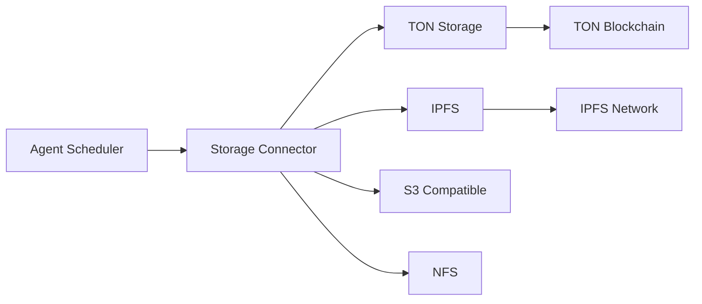
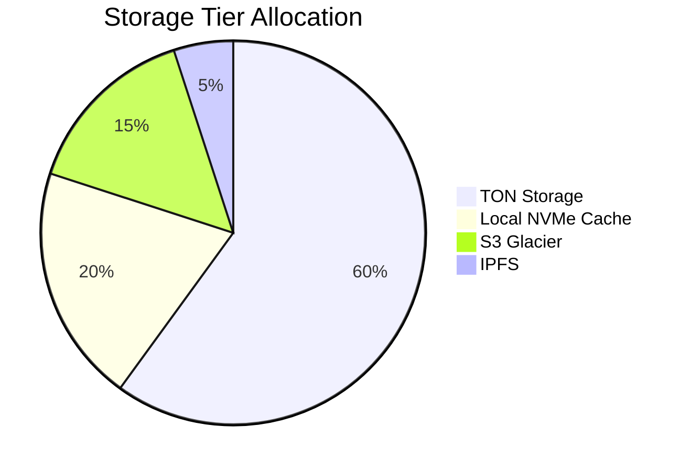

# Storage Integration

## Architecture Overview


## TON Storage Integration
### Key Features
- **Decentralized**: Data distributed across TON nodes
- **Incentivized**: Storage providers earn tokens
- **Immutable**: Content-addressed storage with cryptographic verification
- **Scalable**: Petabyte-scale capacity

### Integration API
```python
class TONStorageAdapter:
    def __init__(self, config: dict):
        self.rpc_endpoint = config['rpc_endpoint']
        self.wallet_address = config['wallet_address']
        self.contract_address = config['contract_address']
        
    def store(self, data: bytes) -> str:
        """Store data on TON, returns content ID"""
        
    def retrieve(self, content_id: str) -> bytes:
        """Retrieve data from TON by content ID"""
        
    def incremental_update(self, base_id: str, delta: bytes) -> str:
        """Store delta relative to base, returns new content ID"""
```

## Performance Comparison
| Storage Type | Latency | Throughput | Cost | Best For |
|--------------|---------|------------|------|----------|
| **TON Storage** | 100-500ms | 50 MB/s | $0.01/GB/month | Long-term, immutable data |
| **Local NVMe** | 0.1ms | 3 GB/s | $0.08/GB/month | Hot VM snapshots |
| **S3 Glacier** | 3-5 hours | 40 MB/s | $0.004/GB/month | Cold archives |
| **IPFS** | 200-1000ms | 30 MB/s | Variable | Content distribution |

## Data Lifecycle Management


## Migration Strategy
1. **MVP Phase**: TON Storage only
2. **Phase 2**: Add local caching layer
3. **Phase 3**: Implement tiered storage with automated data movement
4. **Phase 4**: Support multi-cloud storage brokers

## Error Handling
```python
try:
    storage_id = ton_adapter.store(vm_snapshot)
except TONRPCError as e:
    if e.code == 429:
        # Rate limited - implement backoff
        time.sleep(exponential_backoff())
    elif e.code == 507:
        # Insufficient storage balance
        refill_wallet()
    else:
        # Fallback to secondary storage
        s3_adapter.store(vm_snapshot)
