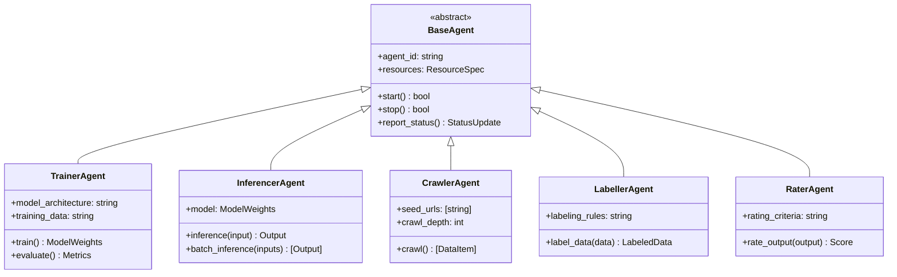
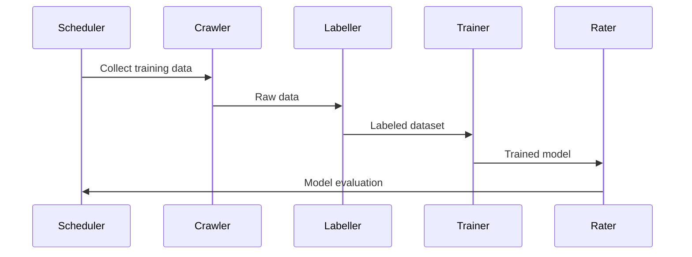
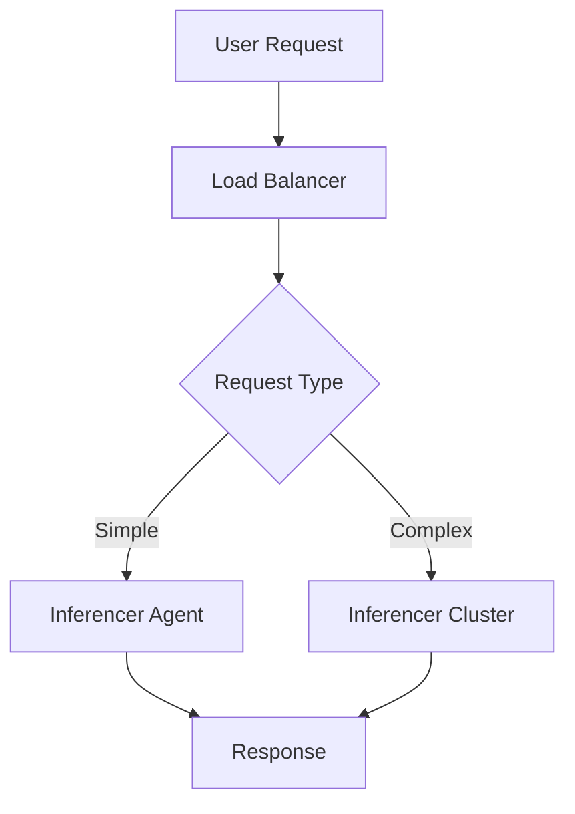

# Agent Types

## Core Agent Architecture

## Workflow Examples
### ML Training Pipeline

### Inference Service

## Security Considerations
1. **Isolation**: Each agent runs in dedicated VM
2. **Input Validation**: Sanitize all external inputs
3. **Resource Limits**: Prevent resource exhaustion attacks
4. **Access Control**: Agent-specific credentials
5. **Audit Logging**: Record all agent operations
