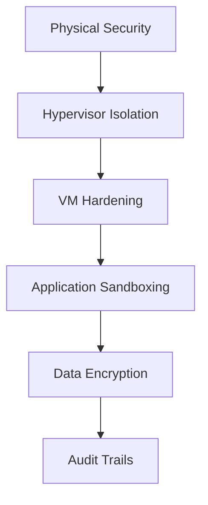

# Security Model

## Defense-in-Depth Strategy


## Key Security Components
1. **VM-Level Security**
   - Minimal OS images (Alpine Linux)
   - Read-only root filesystems
   - AppArmor/SELinux profiles
   - Automatic security updates

2. **Network Security**
   ```mermaid
   flowchart LR
       A[Agent] -->|Mutual TLS| B[API Gateway]
       B -->|IP Whitelisting| C[Scheduler]
       C -->|VLAN Isolation| D[Storage]
   ```

3. **Authentication & Authorization**
   - JWT-based service-to-service auth
   - OAuth 2.0 for admin interfaces
   - RBAC with least privilege
   - Automatic credential rotation

4. **Data Protection**
   - AES-256 encryption at rest
   - TLS 1.3 in transit
   - Client-side encryption for sensitive data
   - Shamir's Secret Sharing for master keys

## Threat Mitigation
| Threat Vector | Mitigation | Verification |
|---------------|------------|--------------|
| **VM Escape** | Hardware-enforced isolation | Regular penetration testing |
| **Data Leakage** | End-to-end encryption | Automated data loss prevention scans |
| **DDoS** | Rate limiting + Cloudflare | Load testing simulations |
| **Supply Chain** | SBOM analysis + Sigstore | Continuous dependency scanning |
| **Insider Threat** | Behavior analytics + MFA | Audit log analysis |

## Security Benchmarks
- **Isolation**: Hardware-enforced VM containment
- **Encryption**: Minimal overhead with AES-NI acceleration
- **Detection**: Real-time anomaly monitoring
- **Response**: Automated containment protocols
