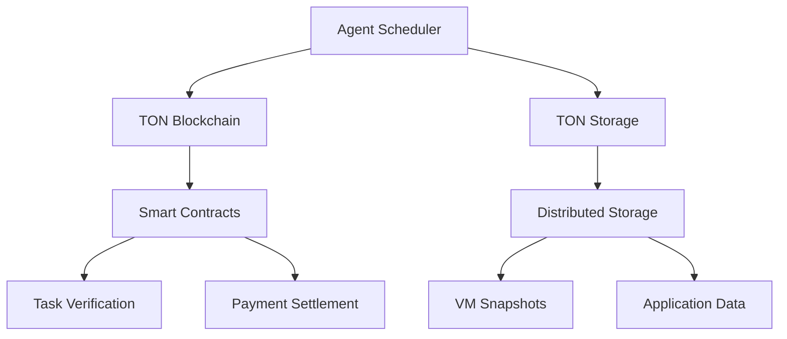

# TON Integration

## Blockchain Architecture

## Key Integration Points
1. **Storage Contracts**
   - Immutable storage proofs
   - Automatic payment distribution
   - Storage auction mechanism
- **Storage Contracts**: Manage immutable storage proofs, payment distribution, and auction mechanisms

2. **Task Verification**
   - Proof-of-Completion validation
   - Dispute resolution mechanisms
   - Reputation scoring

3. **Payment System**
   - Toncoin micropayments
   - Automated task billing
   - Escrow-based payments

## Integration API
- **store_data**: Store data on TON Storage and return content ID
- **verify_task**: Validate task completion on the blockchain
- **process_payment**: Initiate Toncoin payments and return transaction hash
- **resolve_dispute**: Submit evidence for dispute resolution

## Performance Metrics
| Operation | TON Network | Traditional Cloud |
|-----------|-------------|-------------------|
| Storage Cost | $0.01/GB/month | $0.023/GB/month |
| Transaction Latency | 5s | 150ms |
| Dispute Resolution | 15s | 24-72 hours |
| Global Availability | 99.9% | 99.95% |

## Development Roadmap
1. **MVP**: Basic storage integration
2. **Phase 1**: Smart contract verification
3. **Phase 2**: Toncoin payment processing
4. **Phase 3**: Decentralized task marketplace
5. **Phase 4**: Cross-chain interoperability
